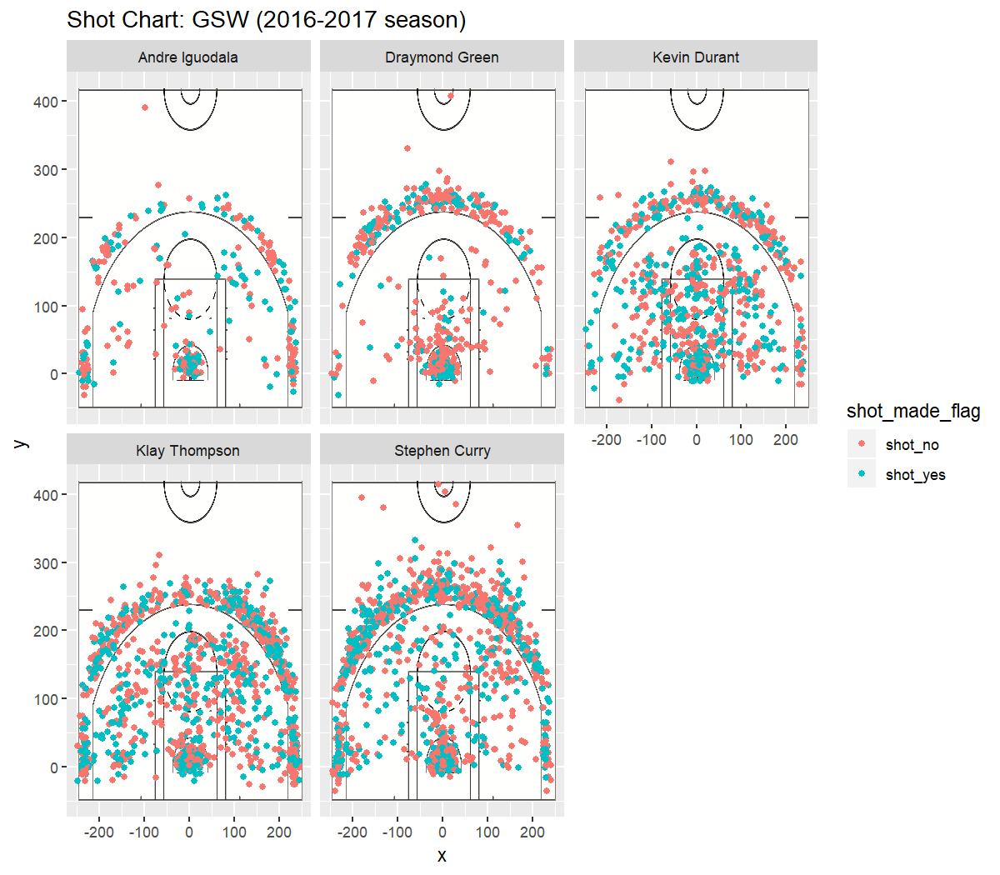

Workout 1
================
Tyler Choe
March 13, 2019

The Warriors are the A-team of the NBA
======================================

The **Warrior Dynasty** is upon us and is in full force with no signs of slowing down. After defeating LeBron James and the Cleveland Cavaliers again for the championship, the Warriors are ready to go into the next season even stronger than before with the acquisition of DeMarcus Cousins. With the starter line-up filled with All-Stars, the Warrior team can be considered a miniature version of an All-Star team or maybe even Team U.S.A.

With such a strong team full of great players, many people wonder if all of the Warriors are equally skilled. It would be easy to guess that some Warriors in the franchise are much better than others and the gap in skill between them is significant. But how big is that gap. Steph Curry is easily the most talked about Warrior as his astronomical 3 point shooting is in a league of its own. But is it good enough to stand out among the other Warriors?

To figure this out, I have obtained the 2 point and 3 point field goals that 5 of the top scoring Warriors have attempted throughout the 2016-2017 season.
The 5 players in question:
- **Stephen Curry**: arguably *the* greatest 3 point shooter of all time and one of the leading point guards in the league.
- **Klay Thompson**: One of the best 2 guards that the league has seen and rivals Steph Curry in the 3 point category.
- **Kevin Durant**: A former Thunder who came to the Warriors looking for a championship. His incredible length and uncanny ability to shoot contested shots make him a scary SF with top-notch mid-range and 3 point shooting.
- **Draymond Green**: A great hustler and expressive warrior who is one of the staple 2-way players in the league.
- **Andre Iguodala**: A veteran player who is experienced in the ball game, and has a 6th man of the year award under his belt.

The Data
--------

All of this data has been conglomerated into a single table with all of the field goals attempted between these 5 players.

    ##     X             team_name game_date season period minutes_remaining
    ## 1   1 Golden State Warriors  12/15/16   2016      3                 3
    ## 2   2 Golden State Warriors  10/28/16   2016      3                 9
    ## 3   3 Golden State Warriors   11/1/16   2016      2                 5
    ## 4   4 Golden State Warriors   12/1/16   2016      3                 5
    ## 5   5 Golden State Warriors    4/4/17   2016      3                 2
    ## 6   6 Golden State Warriors  11/19/16   2016      4                 5
    ## 7   7 Golden State Warriors  11/21/16   2016      3                 9
    ## 8   8 Golden State Warriors   3/29/17   2016      2                 1
    ## 9   9 Golden State Warriors  11/25/16   2016      3                10
    ## 10 10 Golden State Warriors  12/28/16   2016      3                 3
    ## 11 11 Golden State Warriors   3/28/17   2016      4                 9
    ## 12 12 Golden State Warriors  12/11/16   2016      4                 3
    ## 13 13 Golden State Warriors  12/10/16   2016      3                 4
    ## 14 14 Golden State Warriors   2/27/17   2016      1                 9
    ## 15 15 Golden State Warriors    3/6/17   2016      1                 1
    ## 16 16 Golden State Warriors   3/21/17   2016      1                 8
    ## 17 17 Golden State Warriors   12/3/16   2016      3                 9
    ## 18 18 Golden State Warriors   2/27/17   2016      4                 5
    ## 19 19 Golden State Warriors   12/7/16   2016      1                 3
    ## 20 20 Golden State Warriors   3/16/17   2016      3                 5
    ##    seconds_remaining shot_made_flag                    action_type
    ## 1                 51       shot_yes Cutting Finger Roll Layup Shot
    ## 2                 14       shot_yes Cutting Finger Roll Layup Shot
    ## 3                  8       shot_yes Cutting Finger Roll Layup Shot
    ## 4                 27       shot_yes Cutting Finger Roll Layup Shot
    ## 5                  4       shot_yes Cutting Finger Roll Layup Shot
    ## 6                 36       shot_yes Cutting Finger Roll Layup Shot
    ## 7                 51       shot_yes Cutting Finger Roll Layup Shot
    ## 8                 40       shot_yes Cutting Finger Roll Layup Shot
    ## 9                 59       shot_yes             Cutting Layup Shot
    ## 10                54       shot_yes             Cutting Layup Shot
    ## 11                36       shot_yes             Cutting Layup Shot
    ## 12                34       shot_yes             Cutting Layup Shot
    ## 13                12        shot_no             Cutting Layup Shot
    ## 14                29       shot_yes             Cutting Layup Shot
    ## 15                40       shot_yes             Cutting Layup Shot
    ## 16                40       shot_yes             Cutting Layup Shot
    ## 17                14       shot_yes             Cutting Layup Shot
    ## 18                51       shot_yes             Cutting Layup Shot
    ## 19                 8       shot_yes             Cutting Layup Shot
    ## 20                51        shot_no             Cutting Layup Shot
    ##         shot_type shot_distance               opponent   x  y
    ## 1  2PT Field Goal             3        New York Knicks  25 21
    ## 2  2PT Field Goal             2   New Orleans Pelicans   9 26
    ## 3  2PT Field Goal             2 Portland Trail Blazers -22  2
    ## 4  2PT Field Goal             0        Houston Rockets   2  7
    ## 5  2PT Field Goal             2 Minnesota Timberwolves   1 26
    ## 6  2PT Field Goal             0        Milwaukee Bucks   2  7
    ## 7  2PT Field Goal             0         Indiana Pacers  -1  2
    ## 8  2PT Field Goal             2      San Antonio Spurs  28  0
    ## 9  2PT Field Goal             1     Los Angeles Lakers  13  6
    ## 10 2PT Field Goal             1        Toronto Raptors  -9  8
    ## 11 2PT Field Goal             0        Houston Rockets  -4 -5
    ## 12 2PT Field Goal             1 Minnesota Timberwolves  14  7
    ## 13 2PT Field Goal             2      Memphis Grizzlies -24 -6
    ## 14 2PT Field Goal             0     Philadelphia 76ers  -7 -6
    ## 15 2PT Field Goal             2          Atlanta Hawks  20  7
    ## 16 2PT Field Goal             1       Dallas Mavericks  12 -1
    ## 17 2PT Field Goal             1           Phoenix Suns   0 11
    ## 18 2PT Field Goal             1     Philadelphia 76ers  12  7
    ## 19 2PT Field Goal             2   Los Angeles Clippers  -7 21
    ## 20 2PT Field Goal             2          Orlando Magic  22 18
    ##             name minute
    ## 1  Stephen Curry     33
    ## 2  Stephen Curry     27
    ## 3  Stephen Curry     19
    ## 4  Stephen Curry     31
    ## 5  Stephen Curry     34
    ## 6  Stephen Curry     43
    ## 7  Stephen Curry     27
    ## 8  Stephen Curry     23
    ## 9  Stephen Curry     26
    ## 10 Stephen Curry     33
    ## 11 Stephen Curry     39
    ## 12 Stephen Curry     45
    ## 13 Stephen Curry     32
    ## 14 Stephen Curry      3
    ## 15 Stephen Curry     11
    ## 16 Stephen Curry      4
    ## 17 Stephen Curry     27
    ## 18 Stephen Curry     43
    ## 19 Stephen Curry      9
    ## 20 Stephen Curry     31

That's a lot of data! Let's see if we can use a visualization to help us look at much cleaner way of interpreting our data.



Here we see the shot locations for all 5 players and whether or not they made or missed their shots. As we can see, the charts for Iguodala and Draymond Green are much more sparse and clustered in the middle. This makes sense as their primary objectives are to either create openings for other shooters to get open shots or to use their size and strength to get in the paint and get an easier to make layup. On the other side of the spectrum, the charts for Thompson and Curry show much more shots being made all over the court as they are the primary shooters on the team who are dependent upon to make the most amount of points.

However, more shots being attempted does not equate to skill. Furthermore, how do we determine skill in a game as complicated as Basketball where so many different styles and objectives are at play. For our purposes, we will look at the field goal percentages for the 5 players and compare their 2 pt, 3 pt, and overall percentages to gain a more general picture as to who is better at shooting.

From the data table shown above we can manipulate our data to arrive at more useful points of interest.

``` r
two_pt_perc
```

    ## # A tibble: 5 x 4
    ##   name           total  made perc_made
    ##   <fct>          <int> <int>     <dbl>
    ## 1 Andre Iguodala   210   134     0.638
    ## 2 Kevin Durant     643   390     0.607
    ## 3 Stephen Curry    563   304     0.540
    ## 4 Klay Thompson    640   329     0.514
    ## 5 Draymond Green   346   171     0.494

``` r
three_pt_perc
```

    ## # A tibble: 5 x 4
    ##   name           total  made perc_made
    ##   <fct>          <int> <int>     <dbl>
    ## 1 Klay Thompson    580   246     0.424
    ## 2 Stephen Curry    687   280     0.408
    ## 3 Kevin Durant     272   105     0.386
    ## 4 Andre Iguodala   161    58     0.360
    ## 5 Draymond Green   232    74     0.319

``` r
eff_pt_perc
```

    ## # A tibble: 5 x 4
    ##   name           total  made perc_made
    ##   <fct>          <int> <int>     <dbl>
    ## 1 Kevin Durant     915   495     0.541
    ## 2 Andre Iguodala   371   192     0.518
    ## 3 Klay Thompson   1220   575     0.471
    ## 4 Stephen Curry   1250   584     0.467
    ## 5 Draymond Green   578   245     0.424

The first table shows field goal percentages for 2 pointers attempted by each player. The second table is for 3 pointers while the last table is an overall look at field goal percentages for both 2 and 3 pointers.

Analysis
--------

From the looks of it, one thing stands out at first glance. Stephen Curry is not at the top of any of these numbers. Even for 3 point percentages he is behind the .424 of Klay Thompson. For 2 pointers, Andre Iguodala seems to top the team in making those mid range to close range shots. Kevin Durant stands atop the others in the overall field goal table.

These results could be explained by how Stephen Curry is always defended against at all costs while Klay Thompson is allowed some leeway at points. For Andre Iguodala, he attempts much lower shots in the paint than the rest of the Warriors, if he does attempt it, it is when he is quite sure that he's going to make the shot.

From my point of view, I would say that the third table is the best indication of individual skill and that would go to Kevin Durant. He makes over half of his shots and attempted more than 2 times the amount attempted by Andre Iguodala, all while maintaining a higher FG percentage than Andre. However, this view still isn't a surefire way of showing skill as Durant attempted way more 2 pointers which are easier to make than 3 pointers. On a strict shooting standpoint, I would give it to Stephen Curry who consistently makes all kinds of tough attempts at the basket.

Conclusion
----------

Stephen Curry is heralded as the greatest shooter of all time. However, the numbers that we have arrived at suggest that others on the team have better percentages than him.

Still, basketball is not the kind of game where numbers hold much meaning. Players get better or worse between games and get hot or cold even within games. Many points of skill exist in the game which are intangible and can't be quantified by numbers.

All players in the NBA achieved where they are for a reason and every player has a role to play within each team. While Stephen Curry could be the best player on the team, he would be nothing without the help of his other teammates.

As with all things, having others around to help allows one to achieve much greater things than what he could have achieved by himself.
